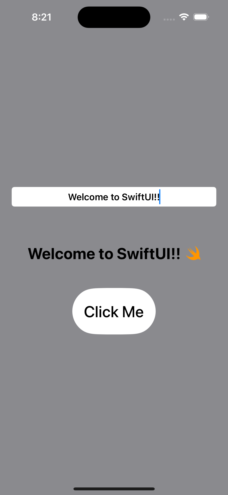

# MyFirstSwiftUI

A simple SwiftUI application demonstrating fundamental SwiftUI concepts.

## App Preview

*The completed app features a text input field, dynamic text display with Swift logo, and an interactive button.*

## Features

- Text input field with state management
- Dynamic text updates based on user input
- SwiftUI styling and layout with ZStack and VStack
- Button interaction with state updates
- Basic UI elements including TextField, Text, Image, and Button

## Concepts Covered

- `@State` property wrapper for managing view state
- Data binding with `$` prefix
- SwiftUI view composition
- Basic styling and layout
- User interaction handling

## Getting Started

1. Open the project in Xcode
2. Build and run the application
3. Experiment with the text field and button to see state changes in action 