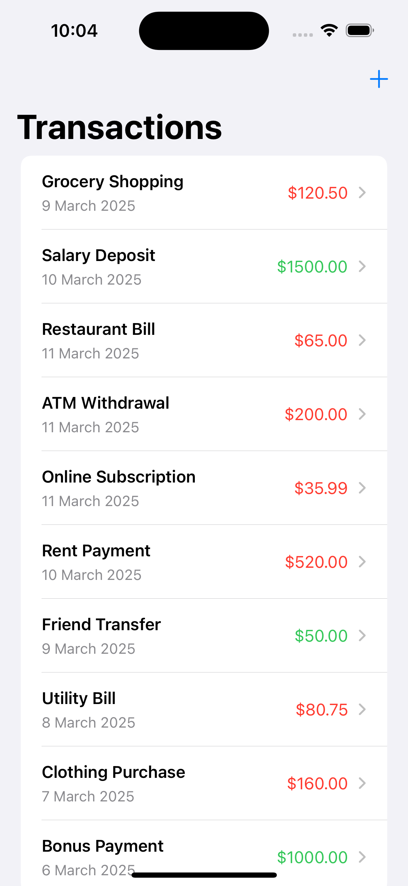
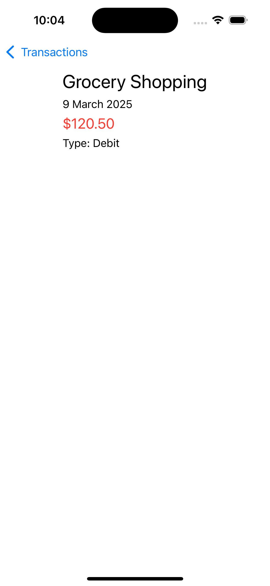
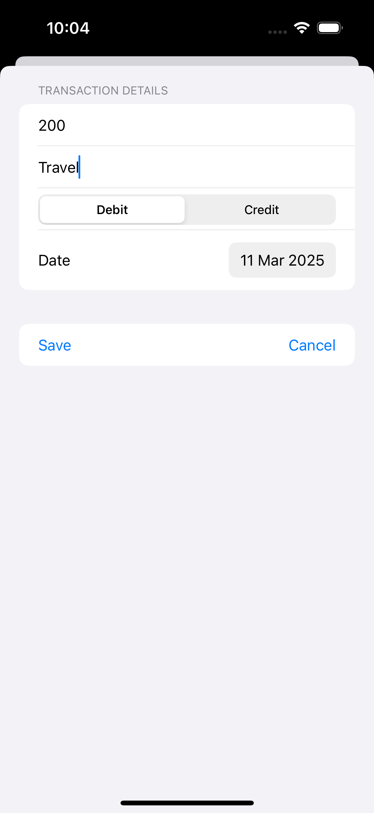

# Transact

A transaction management application built with SwiftUI demonstrating more advanced concepts.

## App Preview

### Transaction List

### Transaction Detail

### Add Transaction

## Features

- List of financial transactions
- Add new transactions
- View transaction details
- Support for credit and debit transaction types
- Color-coded transaction amounts based on type
- Navigation between screens

## Components

- **Transaction.swift**: Data model for transactions
- **TransactionListView.swift**: Main view displaying the list of transactions
- **AddTransactionView.swift**: Form for adding new transactions
- **TransactionDetailView.swift**: Detailed view of a single transaction

## Concepts Covered

- SwiftUI navigation
- Form handling
- Custom data models
- List views and detail views
- CRUD operations in SwiftUI
- Color-coding based on data values
- Date formatting

## Getting Started

1. Open the project in Xcode
2. Build and run the application
3. Explore the transaction list
4. Add new transactions using the add button
5. Tap on transactions to view details 