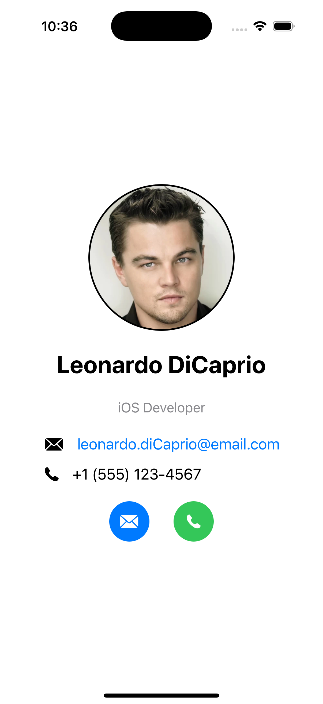

# Session 1 Homework: Profile Card

## Overview

For this homework assignment, you will create a Profile Card application in SwiftUI that displays a user's information in a clean, professional layout.

## Requirements

1. Create a new SwiftUI project named "ProfileCard"
2. Implement a profile screen that includes:
   - A circular profile image
   - User's name displayed prominently
   - User's occupation/title
   - Contact information (email and phone)
   - Action buttons for email and phone contact
