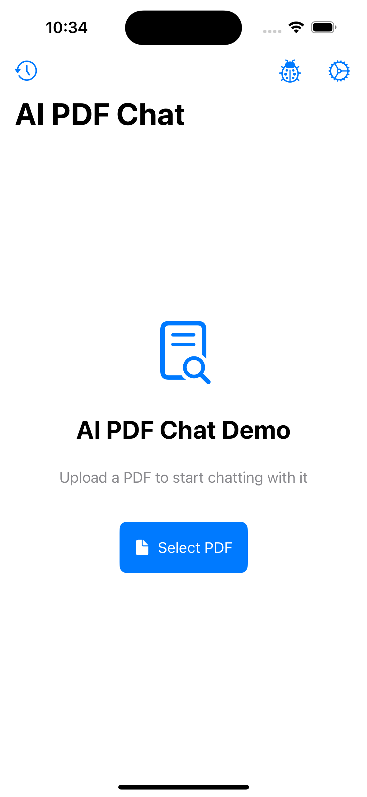
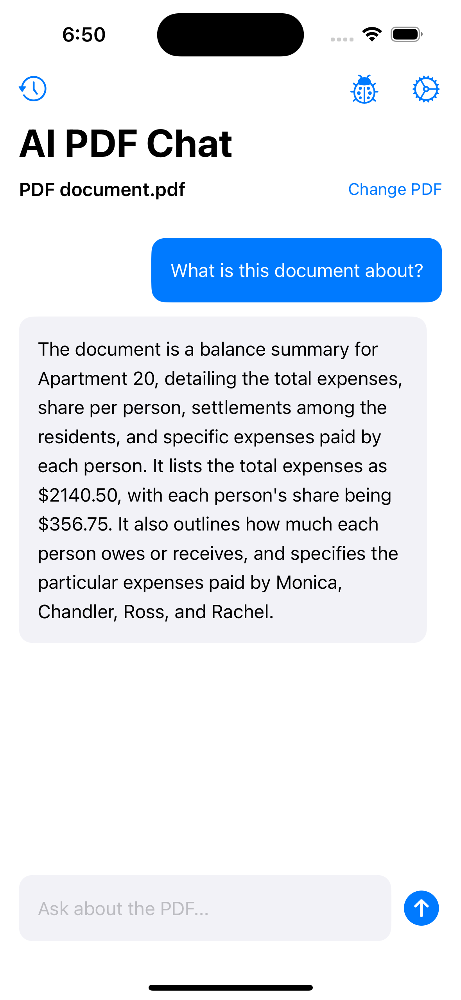

# AI PDF Chat Demo

## Overview

AI PDF Chat Demo is a SwiftUI application that allows users to upload PDF documents and have AI-powered conversations about their content. The app uses OpenAI's API to generate embeddings and provide responses based on the PDF content.

<div align="center">
  
  
</div>

## Features

- **PDF Document Processing**: Upload and process PDF documents
- **AI-Powered Chat**: Ask questions about the PDF content and get responses
- **Semantic Search**: Find relevant content in PDFs using embeddings
- **Chat History**: Save and browse conversation history for each PDF
- **Debugging Tools**: Built-in tools to understand how the AI is processing your questions

## Getting Started

### Prerequisites

- Xcode 15.0 or later
- iOS 17.0 or later
- An OpenAI API key

### Installation

1. Clone the repository
2. Open the project in Xcode
3. Build and run the app on your device or simulator

### Setting Up Your API Key

1. Launch the app
2. Tap the gear icon in the top right corner
3. Enter your OpenAI API key in the settings screen
4. Tap "Save"

## How It Works

### 1. PDF Processing

When you upload a PDF, the app:
- Extracts text from the document
- Splits the text into manageable chunks
- Generates embeddings for each chunk using OpenAI's embedding model

### 2. Asking Questions

When you ask a question about the PDF:
- The app converts your question into an embedding
- It finds the most relevant chunks from the PDF using semantic similarity
- These relevant chunks are sent to OpenAI's GPT model along with your question
- The AI generates a response based on the PDF content

### 3. Retrieval-Augmented Generation (RAG)

This app implements the RAG pattern:
- **Retrieval**: Finding the most relevant parts of the document
- **Augmentation**: Adding this context to the prompt
- **Generation**: Creating a response based on the retrieved information

## Architecture

The app follows the MVVM (Model-View-ViewModel) architecture and SOLID principles:

### Models
- `Message`: Represents chat messages
- `TextChunk`: Represents chunks of text from the PDF with embeddings

### Views
- `ContentView`: Main app interface
- `MessageView`: Displays individual chat messages
- `PDFPickerView`: Handles PDF selection
- `SettingsView`: Manages API key configuration
- `ChatHistoryView`: Displays conversation history
- `ChatDetailView`: Shows detailed conversation for a specific PDF

### ViewModels
- `ChatViewModel`: Manages chat state and interactions

### Services
- `PDFDocumentManager`: Handles PDF loading and processing
- `OpenAIService`: Communicates with OpenAI's API for chat completions
- `EmbeddingService`: Generates and compares text embeddings
- `SwiftDataMessageRepository`: Manages persistence of chat history

## SOLID Principles Applied

The app demonstrates all five SOLID principles with specific implementations:

### 1. Single Responsibility Principle (SRP)

Each class has a focused purpose with a single reason to change:

```swift
// EmbeddingService: Responsible ONLY for generating and comparing embeddings
class EmbeddingService: EmbeddingServiceProtocol {
    func generateEmbedding(for text: String) async throws -> [Float] {
        // Implementation...
    }
    
    func cosineSimilarity(a: [Float], b: [Float]) -> Float {
        // Implementation...
    }
}

// PDFDocumentManager: Responsible ONLY for PDF operations
class PDFDocumentManager {
    func loadPDF(from url: URL) { /* ... */ }
    func extractTextFromPDF() { /* ... */ }
    func createTextChunks(from text: String) { /* ... */ }
}

// Message: Responsible ONLY for representing a chat message
@Model
final class Message: Identifiable {
    // Properties and methods related to a message
}
```

### 2. Open/Closed Principle (OCP)

The code is open for extension but closed for modification:

```swift
// Define protocol that can be extended with new implementations
protocol EmbeddingServiceProtocol {
    func generateEmbedding(for text: String) async throws -> [Float]
    func cosineSimilarity(a: [Float], b: [Float]) -> Float
}

// Current implementation
class EmbeddingService: EmbeddingServiceProtocol {
    // Implementation using OpenAI
}

// Future implementation can be added without modifying existing code
class LocalEmbeddingService: EmbeddingServiceProtocol {
    // Implementation using on-device ML
}
```

### 3. Liskov Substitution Principle (LSP)

Subtypes can be substituted for their base types without affecting program correctness:

```swift
// A protocol defining message repository behavior
protocol MessageRepositoryProtocol {
    func saveMessage(_ message: Message)
    func loadMessages(forPDF pdfFileName: String?) -> [Message]
    func deleteMessages(forPDF pdfFileName: String?)
}

// SwiftData implementation
class SwiftDataMessageRepository: MessageRepositoryProtocol {
    // Implementation using SwiftData
}

// In-memory implementation (could be used for testing)
class InMemoryMessageRepository: MessageRepositoryProtocol {
    // Implementation using in-memory storage
}

// Both implementations can be used interchangeably wherever MessageRepositoryProtocol is required
func setupViewModel() {
    let repository: MessageRepositoryProtocol = isTestMode ? 
        InMemoryMessageRepository() : 
        try! SwiftDataMessageRepository()
    
    viewModel = ChatViewModel(
        openAIService: openAIService,
        pdfManager: pdfManager,
        embeddingService: embeddingService,
        messageRepository: repository
    )
}
```

### 4. Interface Segregation Principle (ISP)

Clients are not forced to depend on interfaces they do not use:

```swift
// Separate protocols for different responsibilities
protocol AICompletionServiceProtocol {
    func generateResponse(messages: [Message], relevantChunks: [String], completion: @escaping (Result<String, Error>) -> Void)
}

protocol EmbeddingServiceProtocol {
    func generateEmbedding(for text: String) async throws -> [Float]
    func cosineSimilarity(a: [Float], b: [Float]) -> Float
}

// Instead of one large protocol with methods the client might not need
// BAD EXAMPLE (not used in our app):
// protocol AIServiceProtocol {
//    func generateResponse(...)
//    func generateEmbedding(...)
//    func generateImage(...)  // Not all clients need this
// }
```

### 5. Dependency Inversion Principle (DIP)

High-level modules depend on abstractions, not concrete implementations:

```swift
class ChatViewModel: ObservableObject {
    // Depends on abstractions (protocols), not concrete implementations
    private let aiService: AICompletionServiceProtocol
    private let embeddingService: EmbeddingServiceProtocol
    private let messageRepository: MessageRepositoryProtocol?
    
    init(
        aiService: AICompletionServiceProtocol,
        pdfManager: PDFDocumentManager,
        embeddingService: EmbeddingServiceProtocol,
        messageRepository: MessageRepositoryProtocol? = nil
    ) {
        self.aiService = aiService
        self.pdfManager = pdfManager
        self.embeddingService = embeddingService
        self.messageRepository = messageRepository
    }
    
    // Methods use the abstractions, not concrete types
}
```

This implementation of SOLID principles makes the app more:

1. **Maintainable**: Each class has a single responsibility
2. **Extensible**: New implementations can be added without modifying existing code
3. **Testable**: Dependencies can be mocked or substituted
4. **Flexible**: Components can be swapped without affecting other parts of the system
5. **Decoupled**: High-level modules are not dependent on low-level details

## Understanding OpenAI Integration

### API Key

The app requires an OpenAI API key to function. This key is used to authenticate requests to OpenAI's API services.

### Models Used

- **Text Embedding**: `text-embedding-3-small` - Converts text into numerical vectors
- **Chat Completion**: `gpt-4o` - Generates responses based on conversation history and context

### Embeddings

Embeddings are numerical representations of text that capture semantic meaning. The app uses embeddings to:
1. Convert PDF chunks into vectors
2. Convert user questions into vectors
3. Find the most similar chunks by calculating vector similarity

### Cosine Similarity

The app uses cosine similarity to measure how similar two embeddings are:
- A value of 1 means identical
- A value of 0 means completely unrelated
- The higher the similarity, the more relevant a chunk is to the question

## Data Persistence

The app uses SwiftData to persist:
- Chat messages
- PDF associations

This allows conversations to be saved between app launches and organized by PDF.

## AI Model Selection

The app allows you to choose between different OpenAI models for chat completions and embeddings, giving you control over the balance between performance and cost.

### Chat Models

You can select from the following models for generating responses:

- **GPT-4o (Default)**: OpenAI's most advanced model, offering the highest quality responses with multimodal capabilities
- **GPT-4 Turbo**: A powerful model with a good balance of capability and cost
- **GPT-3.5 Turbo**: A faster and more economical option, suitable for simpler questions

### Embedding Models

For semantic search functionality, you can choose between:

- **text-embedding-3-small (Default)**: A balanced model with good semantic understanding and cost-effectiveness
- **text-embedding-3-large**: Higher-dimensional embeddings that provide more accurate semantic search at a higher cost
- **text-embedding-ada-002**: Legacy embedding model for backward compatibility

### Changing Models

To change the AI models:

1. Tap the gear icon (⚙️) in the upper right corner to open Settings
2. Under "Model Selection", choose your preferred AI model
3. Under "Embedding Model", select your preferred embedding model
4. Tap "Save" to apply your changes

The app will immediately use your selected models for all new chat interactions and embedding generation.

### Model Selection Considerations

When choosing models, consider these trade-offs:

| Model Type | Higher Performance Models | Economy Models |
|------------|---------------------------|----------------|
| **Chat** | More accurate answers<br>Better reasoning<br>Higher cost | Faster responses<br>Lower cost<br>Less nuanced |
| **Embedding** | More precise content matching<br>Better for technical docs<br>Higher cost | Good for general content<br>Faster processing<br>Lower cost |

For most users, the default models provide an excellent balance of performance and cost. Consider upgrading to more powerful models when working with technical or specialized documents that require more precise understanding.

## License

This project is licensed under the MIT License - see the LICENSE file for details.

## Acknowledgments

- OpenAI for providing the API services
- Apple for SwiftUI and SwiftData frameworks
