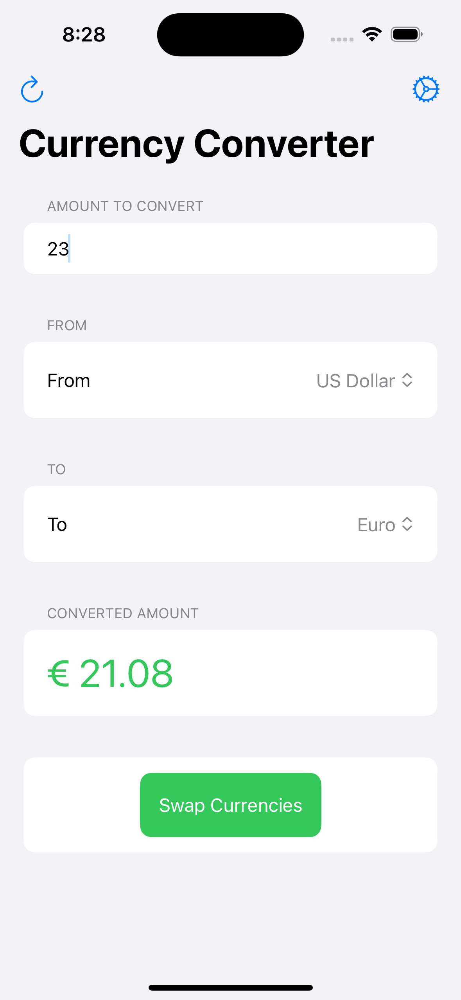
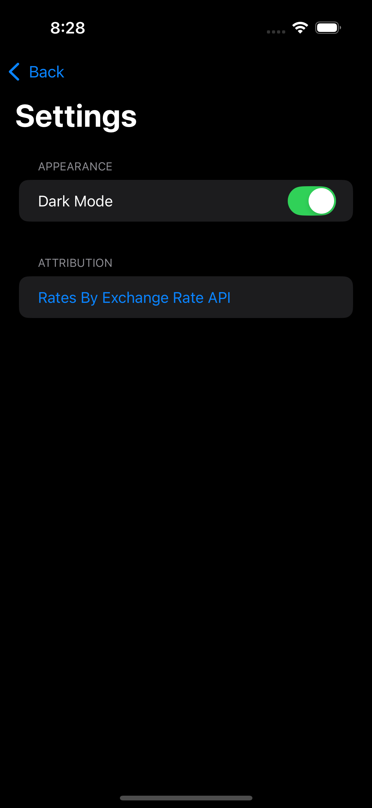

# LiveCurrency

A SwiftUI demo application showcasing modern iOS development techniques.

## Features

- Real-time currency conversion between major currencies
- Live exchange rate updates from Exchange Rate API
- Dark mode support

## App Screenshots

  
  

## Technical Highlights

### Swift Concurrency
- Uses async/await pattern for network requests
- Task-based asynchronous operations
- MainActor for UI updates

### Swift Package Manager
- Integration with SwiftyJSON for API response parsing
- Demonstrates external dependency management

### SwiftUI
- Form-based UI for structured data entry
- Observable object pattern with @Published properties
- Environment-aware themes (@AppStorage for persisting preferences)
- Custom button styles and interactive components

## Getting Started

1. Clone the repository
2. Open in Xcode 15 or later
3. Build and run on iOS 16+ device/simulator

## API Attribution

Exchange rates provided by [Exchange Rate API](https://www.exchangerate-api.com) 